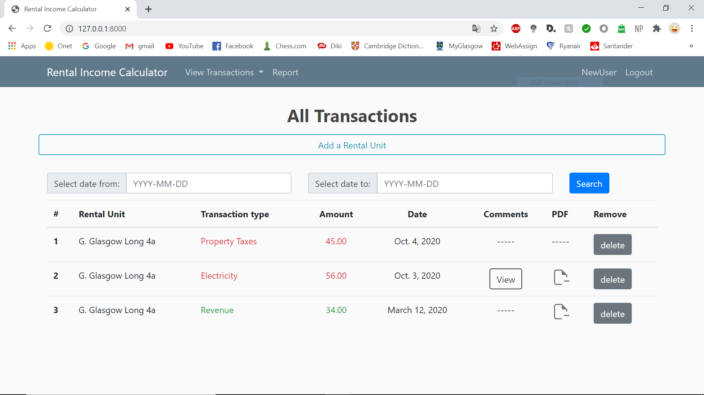
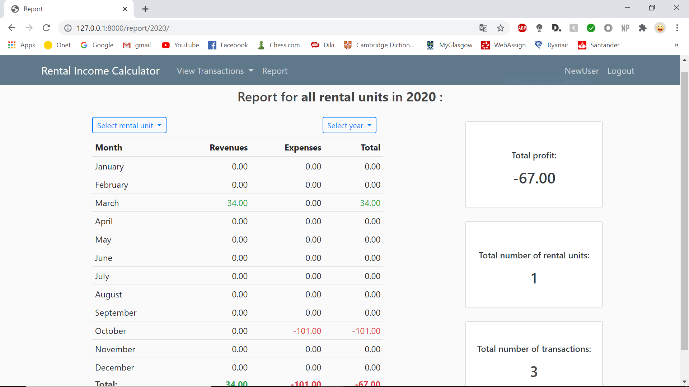

# rental_income_website.github.io  
"# rentalIncomeCalculator"  
Aim of the application:  
With this application a user is able to sign up and log in to their account where they can view the income and expenses for the units they rent.
The user is able to add/delete rental units, add/delete transactions correspinding to their rental units, view their expenses and check the amount earned in a chosen 
month or year.

Technologies used:  
This application is based on the Django framework. This framework offers a file storage system and filters which have been used to store pdf files and to select transactions by a range of dates.  
HTML, CSS and Bootstrap were the front-end technologies used in this project.

